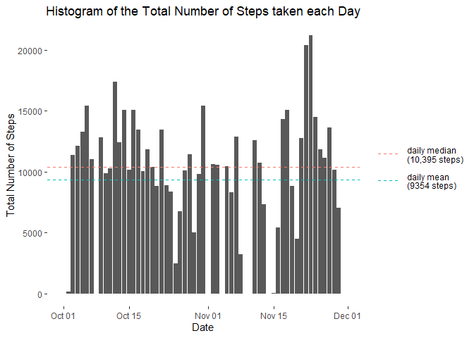
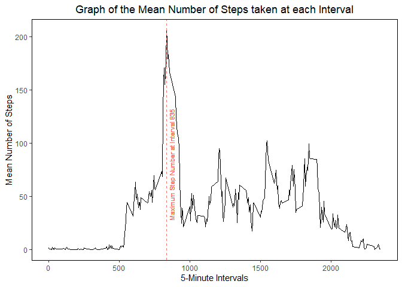
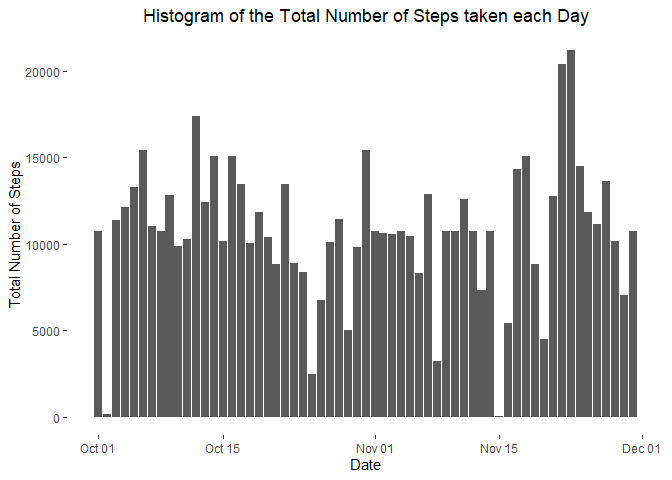
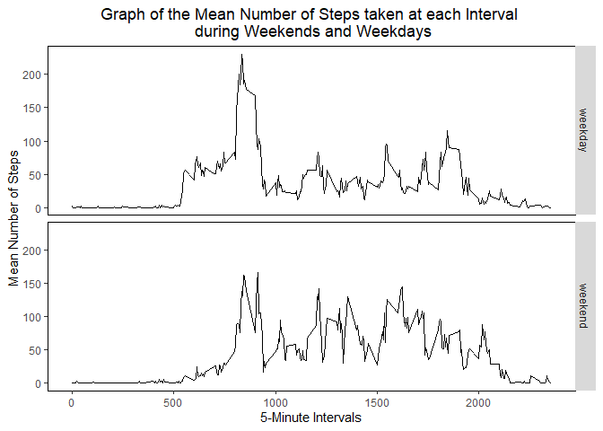

Introduction
------------

For the analyses of this assignment, the following packages were
installed and loaded using the commands `install.packages()` and
`library()`: "lubridate" (package version 1.7.8), "dplyr" (package
version 0.8.3), and "ggplot2" (package version 3.3.3).

    # loading packages, make sure they are loaded in this order!
     library(lubridate)
     library(dplyr)
     library(ggplot2)

1. Loading and Preprocessing the Data
-------------------------------------

The working directory was set using the command `setwd()`, and the
appropriate directory was created using the command `dir.create()`. The
zipfile was downloaded into this directory using the command
`download.file()` (Accessed on the 16th March 2021). The zipfile was
subsequently unzipped using the command `unzip()` to directly save the
unzipped files into the specified folder in the newly created directory
within the working directory. Finally, the data was read into R using
the command `read.csv()`, and saved as the object "data". This object
has 17568 observations and 3 variables.

    # make sure langauge setting is in English!
    # Sys.getlocale()  
    Sys.setlocale("LC_ALL", "English")

    ## [1] "LC_COLLATE=English_United States.1252;LC_CTYPE=English_United States.1252;LC_MONETARY=English_United States.1252;LC_NUMERIC=C;LC_TIME=English_United States.1252"

    # set working directory 
    setwd("G:/My Drive/R_Coursera_Lectures/5_Reproducible_Research")
      if(!file.exists("./coursera_reproducibleresearch_assignmentweek2")) {
        dir.create("./coursera_reproducibleresearch_assignmentweek2")
      }

    # downloading the file (url)
    fileurl <- "https://d396qusza40orc.cloudfront.net/repdata%2Fdata%2Factivity.zip"
    download.file(fileurl, destfile = "./coursera_reproducibleresearch_assignmentweek2/dataset.zip")

    # unzipping the zip file 
    unzip(zipfile = "./coursera_reproducibleresearch_assignmentweek2/dataset.zip", 
          exdir = "./coursera_reproducibleresearch_assignmentweek2")

    # read in the csv file 
    data <- read.csv("./coursera_reproducibleresearch_assignmentweek2/activity.csv")

    # exploring the dataset
    head(data)

    ##   steps       date interval
    ## 1    NA 2012-10-01        0
    ## 2    NA 2012-10-01        5
    ## 3    NA 2012-10-01       10
    ## 4    NA 2012-10-01       15
    ## 5    NA 2012-10-01       20
    ## 6    NA 2012-10-01       25

    summary(data)

    ##      steps                date          interval     
    ##  Min.   :  0.00   2012-10-01:  288   Min.   :   0.0  
    ##  1st Qu.:  0.00   2012-10-02:  288   1st Qu.: 588.8  
    ##  Median :  0.00   2012-10-03:  288   Median :1177.5  
    ##  Mean   : 37.38   2012-10-04:  288   Mean   :1177.5  
    ##  3rd Qu.: 12.00   2012-10-05:  288   3rd Qu.:1766.2  
    ##  Max.   :806.00   2012-10-06:  288   Max.   :2355.0  
    ##  NA's   :2304     (Other)   :15840

    # change the columns to appropriate type 
    data$date <- ymd(as.character(data$date))

2. Using a Histogram to Illustrate the Total Number of Steps taken per Day
--------------------------------------------------------------------------

For the part of the assignment, the total number of steps taken per day
was calculated. The results were illustrated using a histogram.
Additionally, the mean and median of the total number of steps taken
each day was reproted. To this end, the data from "data" was first
grouped together by the date on which they were collected using the
`group_by()` function, and subsequently the total number of steps taken
per day was calculated using the `sum()` function (all NA value were
removed from this calculation). A new dataframe "data2" was generated
containing the the total number of steps taken on each day. The `mean()`
and `median()`functions were used to calculate the mean and median,
respectively (alternatively, these values could have been calculated wth
the `summary()` function). Using `geom_hist()` from `ggplot()`, the data
in "data2" was plotted to generate "DailySteps". The daily mean and
median number of steps taken are 9354 and 10395 steps, respectively.

    # processing the data
    data2 <- data %>%
      group_by(date) %>%
      summarise(dailysteps = sum(steps, na.rm = TRUE))

    # calculating mean and median
    mean1 <- mean(data2$dailysteps)
    median1 <- median(data2$dailysteps)

    # plotting the data
    DailySteps <- ggplot(data2, aes(x = date, y = dailysteps)) +
      geom_histogram(stat = "identity") + 
      geom_hline(aes(yintercept = median(dailysteps), color = "red"), linetype = "dashed") +
      geom_hline(aes(yintercept = mean(dailysteps), color = "teal"), linetype = "dashed") +
      scale_color_discrete(labels = c("daily median \n(10,395 steps)", "daily mean \n(9354 steps)")) +
      labs(x = "Date", y = "Total Number of Steps") +
      ggtitle("Histogram of the Total Number of Steps taken each Day") +
      theme(plot.title = element_text(hjust = 0.5),
            panel.background = element_rect(fill = "white"),
            legend.position = "right", 
            legend.title = element_blank(),
            legend.box.background = element_rect(color = "transparent"),
            legend.key = element_rect(colour = NA, fill = NA), 
            legend.key.size = unit(1, "cm"))
      
    DailySteps

3. Average Daily Activity Pattern
---------------------------------

For the part of the assignment, a time series plot (i.e. type = "l")
showing the averge number of steps taken per 5-minute intervale averaged
across all days was generated. Here, the data from "data" was first
grouped together by the interval using the `group_by()` function, and
subsequently the mean number of steps taken per interval across all days
was calculated using the `mean()` function (all NA values were removed
from this calculation). The resulting dataframe was named "data3". The
interval containing the maximum number of steps was calculated by
finding the maximum value in the "mean" column of "data3" using the
`max()`function. The graph "IntervalSteps" was generated using
`geom_freqpol()` from `ggplot()`. The 5-minute interval number 835
containied the highest mean number of steps (206 steps).

    # processing the data
    data3 <- data %>%
      group_by(interval) %>%
      summarise(mean = mean(steps, na.rm=TRUE))

    #identifying the interval with the maximum step number
    maxinterval = data3$interval[data3$mean == max(data3$mean)]

    # plotting the data
    IntervalSteps <- ggplot(data3, aes(x = interval, y = mean)) +
      geom_freqpoly(stat = "identity") +
      geom_vline(aes(xintercept = interval[mean == max(mean)], color = "red"), linetype = "dashed") +
      labs(x = "5-Minute Intervals", y = "Mean Number of Steps") +
      ggtitle("Graph of the Mean Number of Steps taken at each Interval") +
      theme(plot.title = element_text(hjust = 0.5),
            panel.background = element_rect(fill = "white"),
            panel.border = element_rect(colour = "black", fill=NA, size=0.5), 
            legend.position = "none") +
      geom_text(size = 3, aes(x=870, y= 80, 
                    label = "Maximum Step Number at Interval 835", 
                    color = "red", 
                    angle = 90))
    IntervalSteps

4. Imputing Missing Values
--------------------------

The original "data" dataframe contained several days for which the
number of steps was not recorded. These missing values were recorded as
"NA". Missing values may introduce bias into some of the calculations
and summaries of the data in "data". The aim of this exercise was to
first calculate and report the total number missing values in the
dataset. A new dataframe "data\_NA" was created from "data" containing
only those rows in which there was an "NA" value in the "steps" column
using the `filter()`function. The number of rows in "data\_NA" was
counted using the `nrow()`function to identify the number of NA's in the
original dataset. There are 2304 rows with missing data, corresponding
to 8 days on which no data was collected.  
The second aim of this exercise was to fill in all missing values in the
dataset. To this end, a new data set "data\_noNA" was created from
"data" containing only those rows in which there were no "NA" values in
the "steps" column using the `filter()`function. The data from "data"
was first grouped together by the interval using the `group_by()`
function, and subsequently the mean number of steps taken per interval
across all days was calculated using the `mean()` function. This
resulting dataframe was named "data4". From the first step of this
question it was apparent that 8 days worth of data are missing in the
dataframe "data". A new dataframe "seqNA" was created by repeating the
"mean" column of "data4" using the `rep()` function and saving the
result as a dataframe. Then, using the `cbind()`function, "seqNA" was
bound to the dataframe "data\_NA" to generate the dataframe "data\_NA2".
Subsequently, the columns of "data\_NA2" were reordered and renamed so
that they matched those of "data\_noNA". Using the `rbind()`function,
the rows of "data\_noNA" and "data\_NA3" were bound together and ordered
according to "date" and "interval" using the `arrange()` function. The
final dataframe was named "data\_imputtedNA".  
Using `geom_hist()` from `ggplot()`, the data in "data\_imputtedNA" was
plotted to generate "DailySteps\_noNA". The mean and median values of
daily steps is now slightly higher since the missing values have been
imputted than before; 10766 daily steps for both mean and median as
opposed to the previous 9354 and 10395 steps, respectively.

    # subset data where there are missing values (NAs)
    # we have 2304 rows with NAs in the original dataset
    data_NA <- data %>%
      filter(is.na(steps))

    nrow(data_NA)

    ## [1] 2304

    # subset data where there are no missing values (no NAs)
    # we have 15264 rows without NAs in the original dataset
    data_noNA <- data %>%
      filter(!is.na(steps))

    # calculate the mean number of steps for each interval
    # we have a total of 288 invertals
    data4 <- data_noNA %>%
      group_by(interval) %>%
      summarise(mean = mean(steps))

    # repeat data4 8x (8x288 = 2304)
    seqNA <- as.data.frame(rep(data4$mean, 8))

    # cbind seqNA to data_NA
    data_NA2 <- cbind(data_NA, seqNA)

    # remove/rename/reorder columns in data_NA3 to match those of data_noNA
    data_NA3 <- data_NA2[,-c(1)]

    data_NA3 <- data_NA3 %>%
      rename(steps = 3)

    data_NA3 <- data_NA3[, c(3, 1, 2)]
      
    # rbind the data_noNA and data_NA3 dataframes together
    data_imputtedNA <- rbind(data_noNA, data_NA3) %>%
      arrange(date, interval)

    # calculating the mean and median number of steps taken per day
    data_imputtedNA2 <- data_imputtedNA %>%
      group_by(date) %>%
      summarise(dailysteps = sum(steps, na.rm = TRUE))

    mean2 <- mean(data_imputtedNA2$dailysteps)
    median2 <- median(data_imputtedNA2$dailysteps)

    # plotting the data
    DailySteps_noNA <- ggplot(data_imputtedNA2, aes(x = date, y = dailysteps)) +
      geom_histogram(stat = "identity") +
      labs(x = "Date", y = "Total Number of Steps") +
      ggtitle("Histogram of the Total Number of Steps taken each Day") +
      theme(plot.title = element_text(hjust = 0.5),
            panel.background = element_rect(fill = "white"),
            legend.position = "right", 
            legend.title = element_blank(),
            legend.box.background = element_rect(color = "transparent"),
            legend.key = element_rect(colour = NA, fill = NA), 
            legend.key.size = unit(1, "cm"))
      
    DailySteps_noNA

5. Are there Differences in Activity Patterns Between Weekdays and Weekends?
----------------------------------------------------------------------------

For the last part of the assignment, the dataset with the filled-in NA
values ("data\_imputtedNA") was used. An additional column was added to
the dataframe indicating which dates corresponded to weekends and which
to weekday. For this step, it was important to double-check that the
system language was set to "English" using the command `Sys.getlocale()`
and `Sys.setlocale("LC_ALL". "English")`. Using the `mutate()` command
from the "dplyr" package, an additional column was added to the
"data\_imputtedNA" dataframe designating which dates from the "date"
column corresponded to "weekdays" and which were "weekends".  
Using the `filter()` function, the dataframe "data\_imputtedNA3" was
split up according to whether the date was a weekday or a weekend, these
rows were then grouped by "interval" using the `group_by()`function and
subsequently summarised to calculate the mean using `mean()`. The
resulting dataframes were called "weekday" and "weekend". Both of these
dataframes have 288 rows, so an additional column repeating the term
"weekday" or "weekend" 288 times was generated using the `rep()`
function and then added to each using `cbind()` resulting in the
dataframes "weekday2" and "weekend2". Finally, the two dataframes were
bound together to create "weekdayweekend". The mean and median values
were calculated using `summary()` and saved in a dataframe "annot". A
panel plot containing a time-series plot was generated using the
`geom_line()` and `facet_grid()` functions from `ggplot()` showing the
average number of steps taken for each interval, averaged across all
weekdays or weekend days called "DayPlot".  
From the graph we can see that the mean and median number of steps taken
on weekdays is slightly lower than on weekends.

    # make sure langauge setting is in English!
      # Sys.setlocale("LC_ALL", "English")
      # Sys.getlocale()
      
    # add in a new column "day" designating which dates are weekends
    data_imputtedNA3 <- data_imputtedNA %>%
      mutate(day = as.factor(ifelse (weekdays(data$date) == "Saturday" | weekdays(data$date) == "Sunday", 
                                     "weekend", 
                                     "weekday")))

    # split the dataframe into weekdays and weekends and calculate average number of steps per interval
    weekday <- data_imputtedNA3 %>%
      filter(day == "weekday") %>%
      group_by(interval) %>%
      summarise(mean = mean(steps))

    weekdayseq <- as.data.frame(rep("weekday", 288))

    weekday2 <- cbind(weekday, weekdayseq)  %>%
      rename(day = 3)

    weekend <- data_imputtedNA3 %>%
      filter(day == "weekend") %>%
      group_by(interval) %>%
      summarise(mean = mean(steps))

    weekendseq <- as.data.frame(rep("weekend", 288))

    weekend2 <- cbind(weekend, weekendseq)  %>%
      rename(day = 3)

    # rbind the weekend and weekday data together 
    weekendweekday <- rbind(weekday2, weekend2)

    # calculating the mean and median
    summary(weekday2)

    ##     interval           mean              day     
    ##  Min.   :   0.0   Min.   :  0.000   weekday:288  
    ##  1st Qu.: 588.8   1st Qu.:  2.247                
    ##  Median :1177.5   Median : 25.803                
    ##  Mean   :1177.5   Mean   : 35.611                
    ##  3rd Qu.:1766.2   3rd Qu.: 50.854                
    ##  Max.   :2355.0   Max.   :230.378

    summary(weekend2)

    ##     interval           mean              day     
    ##  Min.   :   0.0   Min.   :  0.000   weekend:288  
    ##  1st Qu.: 588.8   1st Qu.:  1.241                
    ##  Median :1177.5   Median : 32.340                
    ##  Mean   :1177.5   Mean   : 42.366                
    ##  3rd Qu.:1766.2   3rd Qu.: 74.654                
    ##  Max.   :2355.0   Max.   :166.639

    # plotting
    DayPlot <- ggplot(weekendweekday, aes(x = interval, y = mean)) +
      geom_freqpoly(stat = "identity") +
      labs(x = "5-Minute Intervals", y = "Mean Number of Steps") +
      ggtitle("Graph of the Mean Number of Steps taken at each Interval \n during Weekends and Weekdays") +
      theme(plot.title = element_text(hjust = 0.5),
            panel.background = element_rect(fill = "white"),
            panel.border = element_rect(colour = "black", fill=NA, size=0.5), 
            legend.position = "none") +
      facet_grid(day ~.)
      
    DayPlot

\`\`\`
